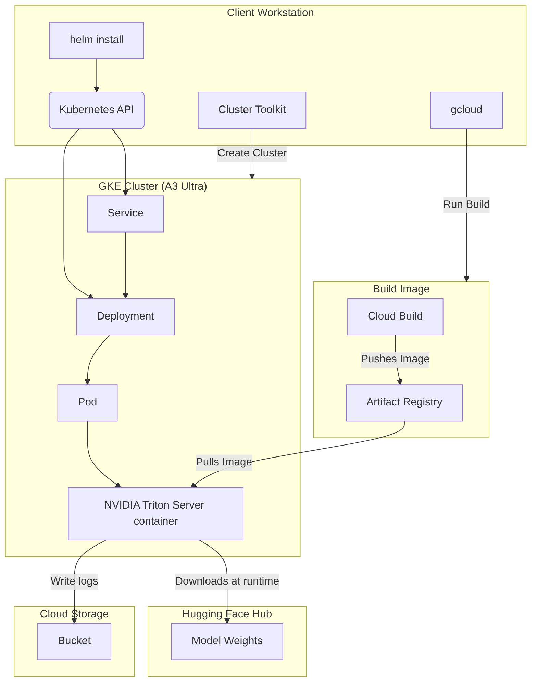

# Single Host Model Serving with NVIDIA TensorRT-LLM (TRT-LLM) on A3 Ultra GKE Node Pool

This document outlines the steps to serve and benchmark various Large Language Models (LLMs) using the [NVIDIA TensorRT-LLM](https://github.com/NVIDIA/TensorRT-LLM) framework on a single [A3 Ultra GKE Node pool](https://cloud.google.com/kubernetes-engine).

This guide walks you through setting up the necessary cloud infrastructure, configuring your environment, and deploying a high-performance LLM for inference.

<a name="table-of-contents"></a>
## Table of Contents

* [1. Test Environment](#test-environment)
* [2. High-Level Architecture](#architecture)
* [3. Environment Setup (One-Time)](#environment-setup)
  * [3.1. Clone the Repository](#clone-repo)
  * [3.2. Configure Environment Variables](#configure-vars)
  * [3.3. Connect to your GKE Cluster](#connect-cluster)
  * [3.4. Get Hugging Face Token](#get-hf-token)
  * [3.5. Create Hugging Face Kubernetes Secret](#setup-hf-secret)
  * [3.6. Build the vLLM Serving Image](#build-image)
* [4. Run the Recipe](#run-the-recipe)
  * [4.1. Inference benchmark for Llama 3.1 405B](#serving-llama-3.1-405b)
* [5. Monitoring and Troubleshooting](#monitoring)
  * [5.1. Check Deployment Status](#check-status)
  * [5.2. View Logs](#view-logs)
* [6. Cleanup](#cleanup)

<a name="test-environment"></a>
## 1. Test Environment

[Back to Top](#table-of-contents)

The recipe uses the following setup:

* **Orchestration**: [Google Kubernetes Engine (GKE)](https://cloud.google.com/kubernetes-engine)
* **Deployment Configuration**: A [Helm chart](https://helm.sh/) is used to configure and deploy a [Kubernetes Deployment](https://kubernetes.io/docs/concepts/workloads/controllers/deployment/). This deployment encapsulates the inference of the target LLM using the vLLM framework.

This recipe has been optimized for and tested with the following configuration:

* **GKE Cluster**:
    * A [regional standard cluster](https://cloud.google.com/kubernetes-engine/docs/concepts/configuration-overview) version: `1.31.7-gke.1265000` or later.
    * A GPU node pool with 1 [a3-ultragpu-8g](https://cloud.google.com/compute/docs/gpus#h200-gpus) machine.
    * [Workload Identity Federation for GKE](https://cloud.google.com/kubernetes-engine/docs/concepts/workload-identity) enabled.
    * [Cloud Storage FUSE CSI driver for GKE](https://cloud.google.com/kubernetes-engine/docs/concepts/cloud-storage-fuse-csi-driver) enabled.
    * [DCGM metrics](https://cloud.google.com/kubernetes-engine/docs/how-to/dcgm-metrics) enabled.
    * [Kueue](https://kueue.sigs.k8s.io/docs/reference/kueue.v1beta1/) and [JobSet](https://jobset.sigs.k8s.io/docs/overview/) APIs installed.
    * Kueue configured to support [Topology Aware Scheduling](https://kueue.sigs.k8s.io/docs/concepts/topology_aware_scheduling/).
* A regional Google Cloud Storage (GCS) bucket to store logs generated by the recipe runs.

> [!IMPORTANT]
> To prepare the required environment, see the [GKE environment setup guide](../../../../docs/configuring-environment-gke-a3-ultra.md).
> Provisioning a new GKE cluster is a long-running operation and can take **20-30 minutes**.

<a name="architecture"></a>
## 2. High-Level Flow

[Back to Top](#table-of-contents)

Here is a simplified diagram of the flow that we follow in this recipe:



* **helm:** A package manager for Kubernetes to define, install, and upgrade applications. It's used here to configure and deploy the Kubernetes Deployment.
* **Deployment:** Manages the lifecycle of your model server pod, ensuring it stays running.
* **Service:** Provides a stable network endpoint (a DNS name and IP address) to access your model server.
* **Pod:** The smallest deployable unit in Kubernetes. The Triton server container with TensorRT-LLM runs inside this pod on a GPU-enabled node.
* **Cloud Build:** A service to run build jobs on Google Cloud to build the Triton server container container image.
* **Artifact Registry:** A single place to manage container images.
* **Cloud Storage:** A Cloud Storage bucket to store benchmark logs and other artifacts.

<a name="environment-setup"></a>
## 3. Environment Setup (One-Time)

[Back to Top](#table-of-contents)

First, you'll configure your local environment. These steps are required once before you can deploy any models.

<a name="clone-repo"></a>
### 3.1. Clone the Repository

```bash
git clone [https://github.com/ai-hypercomputer/gpu-recipes.git](https://github.com/ai-hypercomputer/gpu-recipes.git)
cd gpu-recipes
export REPO_ROOT=$(pwd)
export RECIPE_ROOT=$REPO_ROOT/inference/a3ultra/single-host-serving/vllm
```

<a name="configure-vars"></a>
### 3.2. Configure Environment Variables

This is the most critical step. These variables are used in subsequent commands to target the correct resources.

```bash
export PROJECT_ID=<PROJECT_ID>
export REGION=<REGION_for_cloud_build>
export CLUSTER_REGION=<REGION_of_your_cluster>
export CLUSTER_NAME=<YOUR_GKE_CLUSTER_NAME>
export KUEUE_NAME=<YOUR_KUEUE_NAME>
export ARTIFACT_REGISTRY=<your-artifact-registry-repo-full-path>
export GCS_BUCKET=<your-gcs-bucket-for-logs>
export TRTLLM_IMAGE=trtllm
export TRTLLM_VERSION=v0.17.0
export TRITON_SERVER_VERSION=25.02-trtllm-python-py3

# Set the project for gcloud commands
gcloud config set project $PROJECT_ID
```

Replace the following values:

| Variable              | Description                                                                                             | Example                                                 |
| --------------------- | ------------------------------------------------------------------------------------------------------- | ------------------------------------------------------- |
| `PROJECT_ID` | Your Google Cloud Project ID. | `gcp-project-12345` |
| `REGION` | The GCP region to run the Cloud Build job. | `us-central1` |
| `CLUSTER_REGION` | The GCP region where your GKE cluster is located. | `us-central1` |
| `CLUSTER_NAME` | The name of your GKE cluster. | `a3-ultra-cluster` |
| `KUEUE_NAME` | The name of the Kueue local queue. The default queue created by the cluster toolkit is `a3-ultra`. Verify the name in your cluster. | `a3-ultra` |
| `ARTIFACT_REGISTRY` | Full path to your Artifact Registry repository. | `us-central1-docker.pkg.dev/gcp-project-12345/my-repo` |
| `GCS_BUCKET` | Name of your GCS bucket (do not include `gs://`). | `my-benchmark-logs-bucket` |
| `TRTLLM_IMAGE` | The name for the Docker image to be built. | `trtllm` |
| `TRTLLM_VERSION` | The tag/version for the Docker image. | `v0.17.0` |
| `TRITON_SERVER_VERSION` | The NVIDIA Triton inference server version tag to be used as base image to build TensorRT-LLM. | `25.02-trtllm-python-py3` |


<a name="connect-cluster"></a>
### 3.3. Connect to your GKE Cluster

Fetch credentials for `kubectl` to communicate with your cluster.

```bash
gcloud container clusters get-credentials $CLUSTER_NAME --region $CLUSTER_REGION
```

<a name="get-hf-token"></a>
### 3.4. Get Hugging Face token

To access models through Hugging Face, you'll need a Hugging Face token.
  1.  Create a [Hugging Face account](https://huggingface.co/) if you don't have one.
  2.  For **gated models** like Llama 4, ensure you have requested and been granted access on Hugging Face before proceeding.
  3.  Generate an Access Token: Go to **Your Profile > Settings > Access Tokens**.
  4.  Select **New Token**.
  5.  Specify a Name and a Role of at least `Read`.
  6.  Select **Generate a token**.
  7.  Copy the generated token to your clipboard. You'll use this later.


<a name="setup-hf-secret"></a>
### 3.5. Create Hugging Face Kubernetes Secret

Create a Kubernetes Secret with your Hugging Face token to enable the job to download model checkpoints from Hugging Face.

```bash
# Paste your Hugging Face token here
export HF_TOKEN=<YOUR_HUGGINGFACE_TOKEN>

kubectl create secret generic hf-secret \
--from-literal=hf_api_token=${HF_TOKEN} \
--dry-run=client -o yaml | kubectl apply -f -
```

<a name="build-image"></a>
### 3.6. Build the vLLM Serving Image

This step uses Cloud Build to create a custom Docker image with vLLM and push it to your Artifact Registry repository.

> [!NOTE]
> This build process can take **up to 30 minutes** as it compiles and installs several dependencies.

```bash
cd $REPO_ROOT/src/docker/trtllm
gcloud builds submit --region=${REGION} \
    --config cloudbuild.yml \
    --substitutions _ARTIFACT_REGISTRY=$ARTIFACT_REGISTRY,_TRTLLM_IMAGE=$TRTLLM_IMAGE,_TRTLLM_VERSION=$TRTLLM_VERSION,_TRITON_SERVER_VERSION=$TRITON_SERVER_VERSION \
    --timeout "2h" \
    --machine-type=e2-highcpu-32 \
    --disk-size=1000 \
    --quiet \
    --async
```

Optionally, you can monitor the build progress by streaming its logs. Replace `<BUILD_ID>` with the ID from the previous command's output.

```bash
BUILD_ID=<BUILD_ID>
gcloud builds log $BUILD_ID --stream --region=$REGION
```

> [!WARNING]
> You may see `pip's dependency resolver` warnings in the build logs. These are generally safe to ignore as long as the Cloud Build job completes successfully.

**You have now completed the environment setup!** You are ready to deploy a model.

<a name="run-the-recipe"></a>
## 4. Run the recipe

[Back to Top](#table-of-contents)

This recipe supports the deployment of the following models:

1.  [Llama 3.1 405B](#serving-llama-3.1-405b)

> [!NOTE]
> After running the recipe with `helm install`, it can take **up to 30 minutes** for the deployment to become fully available. This is because the GKE node must first pull the Docker image and then download the model weights from Hugging Face.

<a name="serving-llama-3.1-405b"></a>
### 4.1. Inference benchmark for Llama 3.1 405B Model

[Back to Top](#table-of-contents)

The recipe runs inference benchmark for [Llama 3.1 405B model](https://huggingface.co/meta-llama/Llama-3.1-405B) converting the Hugging Face checkpoint to [TensorRT-LLM](https://github.com/NVIDIA/TensorRT-LLM) optimized format with FP8 quantization on a single A3 Ultra node.

The recipe does the following steps to run the benchmarking:

1. Download the full Llama 3.1 405B model checkpoints from [Hugging Face](https://huggingface.co/meta-llama/Llama-3.1-405B).
2. Convert the model checkpoints to TensorRT-LLM optimized format.
3. Build TensorRT-LLM engines for the model with FP8 quantization.
4. Run the throughput and/or latency benchmarking.

The recipe uses [`trtllm-bench`](https://github.com/NVIDIA/TensorRT-LLM/blob/main/docs/source/performance/perf-benchmarking.md), a command-line tool from NVIDIA to benchmark the performance of TensorRT-LLM engine. For more information about `trtllm-bench`, see the [TensorRT-LLM documentation](https://github.com/NVIDIA/TensorRT-LLM).

1. Install the helm chart to prepare and benchmark the model using [`trtllm-bench`](https://github.com/NVIDIA/TensorRT-LLM/blob/main/docs/source/performance/perf-benchmarking.md) tool:

    ```bash
    cd $RECIPE_ROOT
    helm install -f values.yaml \
    --set-file workload_launcher=$REPO_ROOT/src/launchers/trtllm-launcher.sh \
    --set-file serving_config=$REPO_ROOT/src/frameworks/a3ultra/trtllm-configs/llama-3.1-405b.yaml \
    --set queue=${KUEUE_NAME} \
    --set volumes.gcsMounts[0].bucketName=${GCS_BUCKET} \
    --set workload.model.name=meta-llama/Llama-3.1-405B \
    --set workload.image=${ARTIFACT_REGISTRY}/${TRTLLM_IMAGE}:${TRTLLM_VERSION} \
    --set workload.framework=trtllm \
    $USER-serving-llama-3-1-405b-model \
    $REPO_ROOT/src/helm-charts/a3ultra/inference-templates/deployment
    ```

  This creates a Helm release and a Deployment named `$USER-serving-llama-3-1-405b-model`, and a Service named `$USER-serving-llama-3-1-405b-model-svc`.

2.  **Check the deployment status.**

    ```bash
    kubectl get deployment/$USER-serving-llama-3-1-405b-model
    ```

    Wait until the `READY` column shows `1/1`. See the [Monitoring and Troubleshooting](#monitoring) section to view the deployment logs.

  > [!NOTE]
  > - This helm chart is configured to run only a single benchmarking experiment for 30k requests for 128 tokens of input/output lengths. To run other experiments, you can add the various combinations provided in the [values.yaml](values.yaml) file.
  > - This deployment process can take **up to 30 minutes** as it downloads the model weights from Hugging Face and then the server loads the model weights.


<a name="monitoring"></a>
## 5. Monitoring and Troubleshooting

[Back to Top](#table-of-contents)

After the model is deployed via Helm as described in the sections [above](#run-the-recipe), use the following steps to monitor the deployment and interact with the model. Replace `<deployment-name>` and `<service-name>` with the appropriate names from the model-specific deployment instructions (e.g., `$USER-serving-llama-3-1-405b-model` and `$USER-serving-llama-3-1-405b-model-svc`).


<a name="check-status"></a>
### 5.1. Check Deployment Status

Check the status of your deployment. Replace the name if you deployed a different model.

```bash
# Example for Llama 3.1 405B
kubectl get deployment/$USER-serving-llama-3-1-405b-model
```

Wait until the `READY` column shows `1/1`. If it shows `0/1`, the pod is still starting up.

> [!NOTE]
> In the GKE UI on Cloud Console, you might see a status of "Does not have minimum availability" during startup. This is normal and will resolve once the pod is ready.

<a name="view-logs"></a>
### 5.2. View Logs

To see the logs from the vLLM server (useful for debugging), use the `-f` flag to follow the log stream:

```bash
kubectl logs -f deployment/$USER-serving-llama-3-1-405b-model
```

You should see logs indicating preparing the model, and then running the throughput benchmark test, similar to this:

```bash
Running benchmark for meta-llama/Llama-3.1-405B with ISL=128, OSL=128, TP=8
[TensorRT-LLM] TensorRT-LLM version: 0.16.0
Parse safetensors files: 100%|██████████| 191/191 [00:01<00:00, 152.55it/s]
[05/28/2025-22:40:28] [TRT-LLM] [I] Found dataset.
[05/28/2025-22:40:29] [TRT-LLM] [I]
===========================================================
= DATASET DETAILS
===========================================================
Max Input Sequence Length:      128
Max Output Sequence Length:     128
Max Sequence Length:    256
Target (Average) Input Sequence Length: 128
Target (Average) Output Sequence Length:        128
Number of Sequences:    30000
===========================================================


[05/28/2025-22:40:29] [TRT-LLM] [I] Max batch size and max num tokens are not provided, use tuning heuristics or pre-defined setting from trtllm-bench.
[05/28/2025-22:40:29] [TRT-LLM] [I] Estimated total available memory for KV cache: 717.36 GB
[05/28/2025-22:40:29] [TRT-LLM] [I] Estimated total KV cache memory: 681.49 GB
[05/28/2025-22:40:29] [TRT-LLM] [I] Estimated max number of requests in KV cache memory: 11076.91
[05/28/2025-22:40:29] [TRT-LLM] [I] Estimated max batch size (after fine-tune): 4096
[05/28/2025-22:40:29] [TRT-LLM] [I] Estimated max num tokens (after fine-tune): 8192
[05/28/2025-22:40:29] [TRT-LLM] [I] Set dtype to bfloat16.
[05/28/2025-22:40:29] [TRT-LLM] [I] Set multiple_profiles to True.
[05/28/2025-22:40:29] [TRT-LLM] [I] Set use_paged_context_fmha to True.
[05/28/2025-22:40:29] [TRT-LLM] [I] Set use_fp8_context_fmha to True.
[05/28/2025-22:40:29] [TRT-LLM] [I] Specified dtype 'auto'; inferred dtype 'bfloat16'.
[05/28/2025-22:40:29] [TRT-LLM] [W] Implicitly setting LLaMAConfig.tie_word_embeddings = False
[05/28/2025-22:40:29] [TRT-LLM] [I] Set nccl_plugin to None.
[05/28/2025-22:40:29] [TRT-LLM] [I] start MpiSession with 8 workers
[01/21/2025-02:18:20] [TRT-LLM] [I]
Loading Model: [1/2]    Loading HF model to memory
Loading checkpoint shards: 100%|██████████| 191/191 [02:56<00:00,  1.08it/s]
Inserted 2649 quantizers
current rank: 0, tp rank: 0, pp rank: 0
Time: 1663.266s
Loading Model: [2/2]    Building TRT-LLM engine
Time: 555.845s
Loading model done.
Total latency: 2219.111s

[05/28/2025-23:22:44] [TRT-LLM] [I]
===========================================================
= ENGINE BUILD INFO
===========================================================
Model Name:             meta-llama/Llama-3.1-405B
Model Path:             /ssd/meta-llama/Llama-3.1-405B
Workspace Directory:    /ssd
Engine Directory:       /ssd/meta-llama/Llama-3.1-405B/tp_8_pp_1

===========================================================
= ENGINE CONFIGURATION DETAILS
===========================================================
Max Sequence Length:            256
Max Batch Size:                 4096
Max Num Tokens:                 8192
Quantization:                   FP8
KV Cache Dtype:                 FP8
===========================================================

[05/28/2025-23:22:44] [TRT-LLM] [I]

===========================================================
ENGINE SAVED: /ssd/meta-llama/Llama-3.1-405B/tp_8_pp_1
===========================================================

[TensorRT-LLM] TensorRT-LLM version: 0.17.0.post1

[05/28/2025-23:24:31] [TRT-LLM] [I] Setting up for warmup...
[05/28/2025-23:24:31] [TRT-LLM] [I] Running warmup.
[05/28/2025-23:24:31] [TRT-LLM] [I] Starting benchmarking async task.
[05/28/2025-23:24:31] [TRT-LLM] [I] Starting benchmark...
[05/28/2025-23:24:31] [TRT-LLM] [I] Request submission complete. [count=2, time=0.0000s, rate=175330.94 req/s]
[05/28/2025-23:24:36] [TRT-LLM] [I] Benchmark complete.
[05/28/2025-23:24:36] [TRT-LLM] [I] Stopping LLM backend.
[05/28/2025-23:24:36] [TRT-LLM] [I] Cancelling all 0 tasks to complete.
[05/28/2025-23:24:36] [TRT-LLM] [I] All tasks cancelled.
[05/28/2025-23:24:36] [TRT-LLM] [I] LLM Backend stopped.
[05/28/2025-23:24:36] [TRT-LLM] [I] Warmup done.
[05/28/2025-23:24:36] [TRT-LLM] [I] Starting benchmarking async task.
[05/28/2025-23:24:36] [TRT-LLM] [I] Starting benchmark...
[05/28/2025-23:24:36] [TRT-LLM] [I] Request submission complete. [count=30000, time=0.0121s, rate=2484491.39 req/s]
[05/28/2025-23:40:58] [TRT-LLM] [I] Benchmark complete.
[05/28/2025-23:40:58] [TRT-LLM] [I] Stopping LLM backend.
[05/28/2025-23:40:58] [TRT-LLM] [I] Cancelling all 0 tasks to complete.
[05/28/2025-23:40:58] [TRT-LLM] [I] All tasks cancelled.
[05/28/2025-23:40:58] [TRT-LLM] [I] LLM Backend stopped.
[05/28/2025-23:40:59] [TRT-LLM] [I]

===========================================================
= ENGINE DETAILS
===========================================================
Model:                  meta-llama/Llama-3.1-405B
Engine Directory:       /ssd/meta-llama/Llama-3.1-405B/tp_8_pp_1
TensorRT-LLM Version:   0.17.0.post1
Dtype:                  bfloat16
KV Cache Dtype:         FP8
Quantization:           FP8
Max Input Length:       256
Max Sequence Length:    256

===========================================================
= WORLD + RUNTIME INFORMATION
===========================================================
TP Size:                8
PP Size:                1
Max Runtime Batch Size: 4096
Max Runtime Tokens:     8192
Scheduling Policy:      Guaranteed No Evict
KV Memory Percentage:   95.00%
Issue Rate (req/sec):   3.1860E+14

===========================================================
= PERFORMANCE OVERVIEW
===========================================================
Number of requests:             30000
Average Input Length (tokens):  128.0000
Average Output Length (tokens): 128.0000
Token Throughput (tokens/sec):  3914.4509
Request Throughput (req/sec):   30.5816
Total Latency (ms):             980980.5121

===========================================================

[05/28/2025-23:40:59] [TRT-LLM] [I] Thread proxy_dispatch_result_thread stopped.
```

<a name="cleanup"></a>
## 6. Cleanup

To avoid incurring further charges, clean up the resources you created.

1.  **Uninstall the Helm Release:**

    First, list your releases to get the deployed models:

    ```bash
    # list deployed models
    helm list --filter $USER-serving-
    ```

    Then, uninstall the desired release:

    ```bash
    # uninstall the deployed model
    helm uninstall <release_name>
    ```
    Replace `<release_name>` with the helm release names listed.

2.  **Delete the Kubernetes Secret:**

    ```bash
    kubectl delete secret hf-secret --ignore-not-found=true
    ```

3.  (Optional) Delete the built Docker image from Artifact Registry if no longer needed.
4.  (Optional) Delete Cloud Build logs.
5.  (Optional) Clean up files in your GCS bucket if benchmarking was performed.
6.  (Optional) Delete the [test environment](#test-environment) provisioned including GKE cluster.