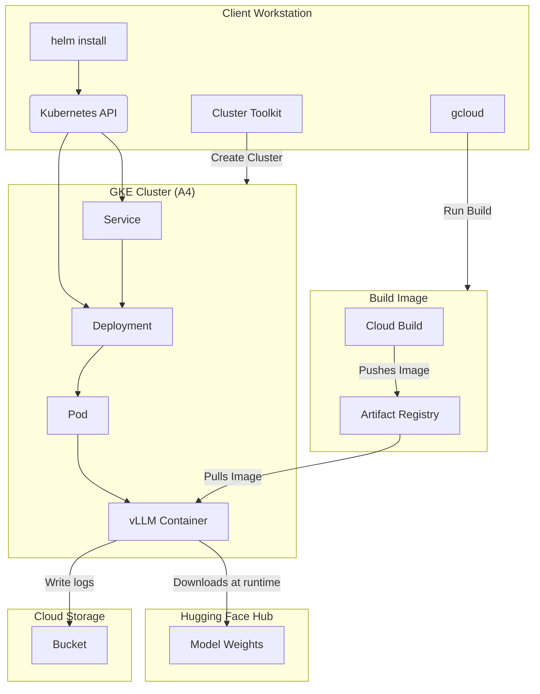

# Single Host Model Serving with vLLM on A4 GKE Node Pool

This document outlines the steps to serve and benchmark various Large Language Models (LLMs) using the [vLLM](https://github.com/vllm-project/vllm) framework on a single [A4 GKE Node pool](https://cloud.google.com/kubernetes-engine).

This guide walks you through setting up the necessary cloud infrastructure, configuring your environment, and deploying a high-performance LLM for inference.

<a name="table-of-contents"></a>
## Table of Contents

* [1. Test Environment](#test-environment)
* [2. High-Level Architecture](#architecture)
* [3. Environment Setup (One-Time)](#environment-setup)
  * [3.1. Clone the Repository](#clone-repo)
  * [3.2. Configure Environment Variables](#configure-vars)
  * [3.3. Connect to your GKE Cluster](#connect-cluster)
  * [3.4. Get Hugging Face Token](#get-hf-token)
  * [3.5. Create Hugging Face Kubernetes Secret](#setup-hf-secret)
  * [3.6. Build the vLLM Serving Image](#build-image)
* [4. Run the Recipe](#run-the-recipe)
  * [4.1. Serving DeepSeek R1 671B](#serving-deepseek)
* [5. Monitoring and Troubleshooting](#monitoring)
  * [5.1. Check Deployment Status](#check-status)
  * [5.2. View Logs](#view-logs)
  * [5.3. Common Issues](#troubleshooting)
* [6. Cleanup](#cleanup)

<a name="test-environment"></a>
## 1. Test Environment

[Back to Top](#table-of-contents)

The recipe uses the following setup:

* **Orchestration**: [Google Kubernetes Engine (GKE)](https://cloud.google.com/kubernetes-engine)
* **Deployment Configuration**: A [Helm chart](https://helm.sh/) is used to configure and deploy a [Kubernetes Deployment](https://kubernetes.io/docs/concepts/workloads/controllers/deployment/). This deployment encapsulates the inference of the target LLM using the vLLM framework.

This recipe has been optimized for and tested with the following configuration:

* **GKE Cluster**:
    * A [regional standard cluster](https://cloud.google.com/kubernetes-engine/docs/concepts/configuration-overview) version: `1.31.7-gke.1265000` or later.
    * A GPU node pool with 1 [a4-highgpu-8g](https://cloud.google.com/compute/docs/accelerator-optimized-machines#a4-vms) machine.
    * [Workload Identity Federation for GKE](https://cloud.google.com/kubernetes-engine/docs/concepts/workload-identity) enabled.
    * [Cloud Storage FUSE CSI driver for GKE](https://cloud.google.com/kubernetes-engine/docs/concepts/cloud-storage-fuse-csi-driver) enabled.
    * [DCGM metrics](https://cloud.google.com/kubernetes-engine/docs/how-to/dcgm-metrics) enabled.
    * [Kueue](https://kueue.sigs.k8s.io/docs/reference/kueue.v1beta1/) and [JobSet](https://jobset.sigs.k8s.io/docs/overview/) APIs installed.
    * Kueue configured to support [Topology Aware Scheduling](https://kueue.sigs.k8s.io/docs/concepts/topology_aware_scheduling/).
* A regional Google Cloud Storage (GCS) bucket to store logs generated by the recipe runs.

> [!IMPORTANT]
> To prepare the required environment, see the [GKE environment setup guide](../../../../docs/configuring-environment-gke-a4.md).
> Provisioning a new GKE cluster is a long-running operation and can take **20-30 minutes**.

<a name="architecture"></a>
## 2. High-Level Flow

[Back to Top](#table-of-contents)

Here is a simplified diagram of the flow that we follow in this recipe:



* **helm:** A package manager for Kubernetes to define, install, and upgrade applications. It's used here to configure and deploy the Kubernetes Deployment.
* **Deployment:** Manages the lifecycle of your model server pod, ensuring it stays running.
* **Service:** Provides a stable network endpoint (a DNS name and IP address) to access your model server.
* **Pod:** The smallest deployable unit in Kubernetes. The vLLM container runs inside this pod on a GPU-enabled node.
* **Cloud Build:** A service to run build jobs on Google Cloud to build the vLLM container image.
* **Artifact Registry:** A single place to manage container images.
* **Cloud Storage:** A Cloud Storage bucket to store benchmark logs and other artifacts.

<a name="environment-setup"></a>
## 3. Environment Setup (One-Time)

[Back to Top](#table-of-contents)

First, you'll configure your local environment. These steps are required once before you can deploy any models.

<a name="clone-repo"></a>
### 3.1. Clone the Repository

```bash
git clone [https://github.com/ai-hypercomputer/gpu-recipes.git](https://github.com/ai-hypercomputer/gpu-recipes.git)
cd gpu-recipes
export REPO_ROOT=$(pwd)
export RECIPE_ROOT=$REPO_ROOT/inference/a4/single-host-serving/vllm
```

<a name="configure-vars"></a>
### 3.2. Configure Environment Variables

This is the most critical step. These variables are used in subsequent commands to target the correct resources.

```bash
export PROJECT_ID=<PROJECT_ID>
export REGION=<REGION_for_cloud_build>
export CLUSTER_REGION=<REGION_of_your_cluster>
export CLUSTER_NAME=<YOUR_GKE_CLUSTER_NAME>
export KUEUE_NAME=<YOUR_KUEUE_NAME>
export ARTIFACT_REGISTRY=<your-artifact-registry-repo-full-path>
export GCS_BUCKET=<your-gcs-bucket-for-logs>
export VLLM_IMAGE=vllm-openai
export VLLM_VERSION=v0.9.1

# Set the project for gcloud commands
gcloud config set project $PROJECT_ID
```

Replace the following values:

| Variable              | Description                                                                                             | Example                                                 |
| --------------------- | ------------------------------------------------------------------------------------------------------- | ------------------------------------------------------- |
| `PROJECT_ID` | Your Google Cloud Project ID. | `gcp-project-12345` |
| `REGION` | The GCP region to run the Cloud Build job. | `us-central1` |
| `CLUSTER_REGION` | The GCP region where your GKE cluster is located. | `us-central1` |
| `CLUSTER_NAME` | The name of your GKE cluster. | `a4-gke-cluster` |
| `KUEUE_NAME` | The name of the Kueue local queue. The default queue created by the cluster toolkit is `a4`. Verify the name in your cluster. | `a4` |
| `ARTIFACT_REGISTRY` | Full path to your Artifact Registry repository. | `us-central1-docker.pkg.dev/gcp-project-12345/my-repo` |
| `GCS_BUCKET` | Name of your GCS bucket (do not include `gs://`). | `my-benchmark-logs-bucket` |
| `VLLM_IMAGE` | The name for the Docker image to be built. | `vllm-openai` |
| `VLLM_VERSION` | The tag/version for the Docker image. | `v0.9.1` |


<a name="connect-cluster"></a>
### 3.3. Connect to your GKE Cluster

Fetch credentials for `kubectl` to communicate with your cluster.

```bash
gcloud container clusters get-credentials $CLUSTER_NAME --region $CLUSTER_REGION
```

<a name="get-hf-token"></a>
### 3.4. Get Hugging Face token

To access models through Hugging Face, you'll need a Hugging Face token.
  1.  Create a [Hugging Face account](https://huggingface.co/) if you don't have one.
  2.  For **gated models** ensure you have requested and been granted access on Hugging Face before proceeding.
  3.  Generate an Access Token: Go to **Your Profile > Settings > Access Tokens**.
  4.  Select **New Token**.
  5.  Specify a Name and a Role of at least `Read`.
  6.  Select **Generate a token**.
  7.  Copy the generated token to your clipboard. You'll use this later.


<a name="setup-hf-secret"></a>
### 3.5. Create Hugging Face Kubernetes Secret

Create a Kubernetes Secret with your Hugging Face token to enable the job to download model checkpoints from Hugging Face.

```bash
# Paste your Hugging Face token here
export HF_TOKEN=<YOUR_HUGGINGFACE_TOKEN>

kubectl create secret generic hf-secret \
--from-literal=hf_api_token=${HF_TOKEN} \
--dry-run=client -o yaml | kubectl apply -f -
```

<a name="build-image"></a>
### 3.6. Build the vLLM Serving Image

This step uses Cloud Build to create a custom Docker image with vLLM and push it to your Artifact Registry repository.

> [!NOTE]
> This build process can take **up to 30 minutes** as it compiles and installs several dependencies.

```bash
cd $REPO_ROOT/src/docker/vllm
gcloud builds submit --region=${REGION} \
    --config cloudbuild.yml \
    --substitutions _ARTIFACT_REGISTRY=$ARTIFACT_REGISTRY,_VLLM_IMAGE=$VLLM_IMAGE,_VLLM_VERSION=$VLLM_VERSION \
    --timeout "2h" \
    --machine-type=e2-highcpu-32 \
    --disk-size=1000 \
    --quiet \
    --async
```

Optionally, you can monitor the build progress by streaming its logs. Replace `<BUILD_ID>` with the ID from the previous command's output.

```bash
BUILD_ID=<BUILD_ID>
gcloud builds log $BUILD_ID --stream --region=$REGION
```

> [!WARNING]
> You may see `pip's dependency resolver` warnings in the build logs. These are generally safe to ignore as long as the Cloud Build job completes successfully.

**You have now completed the environment setup!** You are ready to deploy a model.

<a name="run-the-recipe"></a>
## 4. Run the Recipe

[Back to Top](#table-of-contents)

This recipe supports the deployment of the following models:

1.  [DeepSeek R1 671B](#serving-deepseek)

Now, select a model to deploy. Each section below is self-contained for deploying a specific model.

> [!NOTE]
> After running the recipe with `helm install`, it can take **up to 30 minutes** for the deployment to become fully available. This is because the GKE node must first pull the Docker image and then download the model weights from Hugging Face.

<a name="serving-deepseek"></a>
### 4.1. Serving DeepSeek R1 671B

[Back to Top](#table-of-contents)

This recipe serves the [DeepSeek R1 671B model](https://huggingface.co/deepseek-ai/DeepSeek-R1) using vLLM framework on a single A4 node in native FP8 mode.

Upon launching the vLLM server, it performs the following steps:

1.  Downloads the full DeepSeek R1 671B model checkpoints from Hugging Face.
2.  Loads the model checkpoints and applies vLLM optimizations.
3.  Server is ready to respond to requests.

<a name="deploy-deepseek-r1-671b"></a>
#### 4.1.1. Deploy DeepSeek R1 671B

1.  **Install the helm chart to prepare and serve the model using vLLM framework:**

    ```bash
    cd $RECIPE_ROOT
    helm install -f values.yaml \
    --set-file workload_launcher=$REPO_ROOT/src/launchers/vllm-launcher.sh \
    --set-file serving_config=$REPO_ROOT/src/frameworks/a4/vllm-configs/deepseek-r1-671b.yaml \
    --set queue=${KUEUE_NAME} \
    --set volumes.gcsMounts[0].bucketName=${GCS_BUCKET} \
    --set workload.model.name=deepseek-ai/DeepSeek-R1 \
    --set workload.image=${ARTIFACT_REGISTRY}/${VLLM_IMAGE}:${VLLM_VERSION} \
    --set workload.framework=vllm \
    $USER-serving-deepseek-r1-model \
    $REPO_ROOT/src/helm-charts/a4/inference-templates/deployment
    ```

    This creates a Helm release and a Deployment named `$USER-serving-deepseek-r1-model`, and a Service named `$USER-serving-deepseek-r1-model-svc`.

2.  **Check the deployment status.**

    ```bash
    kubectl get deployment/$USER-serving-deepseek-r1-model
    ```

    Wait until the `READY` column shows `1/1`. See the [Monitoring and Troubleshooting](#monitoring) section to view the deployment logs.

  > [!NOTE]
  > This deployment process can take **up to 30 minutes** as it downloads the model weights from Hugging Face and then the server loads the model weights.

<a name="interact-with-deepseek-r1-671b"></a>
#### 4.1.2. Interact with DeepSeek R1 671B model

1.  **Make an API request:**

    Send a chat message and receive a JSON response from the model:

    ```bash
    kubectl exec -it deployment/$USER-serving-deepseek-r1-model -- \
    curl http://localhost:8000/v1/chat/completions \
    -H "Content-Type: application/json" \
    -d '{
    "model":"deepseek-ai/DeepSeek-R1",
    "messages":[
        {
            "role":"system",
            "content":"You are a helpful AI assistant"
        },
        {
            "role":"user",
            "content":"How many r are there in strawberry ?"
        }
    ],
    "temperature":0.6,
    "top_p":0.95,
    "max_tokens":2048
    }'
    ```
    You should receive a JSON response from the model.

2.  **Stream a chat response:**

    First, open a new terminal session and forward a local port to the service to allow your local machine to communicate with the model server:

    ```bash
    kubectl port-forward svc/$USER-serving-deepseek-r1-model-svc 8000:8000
    ```

    In a separate terminal, run the `stream_chat.sh` utility script:

    ```bash
    $RECIPE_ROOT/stream_chat.sh "Which is bigger 9.9 or 9.11 ?" "deepseek-ai/DeepSeek-R1"
    ```

<a name="benchmark-deepseek-r1-671b"></a>
#### 4.1.3. Benchmark DeepSeek R1 671B

1.  Run the [vLLM benchmarking tool](https://docs.vllm.ai/references/benchmark_and_profiling.html) directly inside the running deployment:

      ```bash
      kubectl exec -it deployment/$USER-serving-deepseek-r1-model -- /bin/sh -c \
      'mkdir -p /gcs/benchmark_logs/vllm && python3 /workspace/vllm/benchmarks/benchmark_serving.py \
        --model deepseek-ai/DeepSeek-R1 \
        --dataset-name random \
        --ignore-eos \
        --num-prompts 1100 \
        --random-input-len 1000 \
        --random-output-len 1000 \
        --port 8000 \
        --backend vllm'
      ```

    Benchmark results are displayed in the logs.

<a name="monitoring"></a>
## 5. Monitoring and Troubleshooting

[Back to Top](#table-of-contents)

After the model is deployed via Helm as described in the sections [above](#run-the-recipe), use the following steps to monitor the deployment and interact with the model. Replace `<deployment-name>` and `<service-name>` with the appropriate names from the model-specific deployment instructions (e.g., `$USER-serving-deepseek-r1-model` and `$USER-serving-deepseek-r1-model-svc`).


<a name="check-status"></a>
### 5.1. Check Deployment Status

Check the status of your deployment. Replace the name if you deployed a different model.

```bash
# Example for DeepSeek
kubectl get deployment/$USER-serving-deepseek-r1-model
```

Wait until the `READY` column shows `1/1`. If it shows `0/1`, the pod is still starting up.

> [!NOTE]
> In the GKE UI on Cloud Console, you might see a status of "Does not have minimum availability" during startup. This is normal and will resolve once the pod is ready.

<a name="view-logs"></a>
### 5.2. View Logs

To see the logs from the vLLM server (useful for debugging), use the `-f` flag to follow the log stream:

```bash
kubectl logs -f deployment/$USER-serving-deepseek-r1-model
```

You should see logs indicating vLLM server downloading/loading the model, and then starting the API server, similar to this:

```
INFO:     Started server process [1]
INFO:     Waiting for application startup.
INFO:     Application startup complete.
INFO:     Uvicorn running on [http://0.0.0.0:8000](http://0.0.0.0:8000) (Press CTRL+C to quit)
```

<a name="troubleshooting"></a>
### 5.3. Common Issues

* **Error: `Connection refused` when using `port-forward`**

    If you are trying to stream responses using `kubectl port-forward` and get a connection error, check the following:

    1.  **Is the deployment ready?** Run `kubectl get deployment` and ensure the `READY` column is `1/1`.
    2.  **Is the port-forward command running?** The command must remain active in its own terminal while you make requests.
    3.  **Check Pod Logs:** Use `kubectl logs -f ...` to check for any error messages.
    4.  **Try again:** Sometimes transient network issues can cause this. Stop the `port-forward` command (`Ctrl+C`) and run it again.

* **Error: `denied: requested access to the resource is denied` during Cloud Build**

    This almost always means the `ARTIFACT_REGISTRY` environment variable is incorrect. It **must** be the full path: `<location>-docker.pkg.dev/<project-id>/<repository-name>`.

* **Error: `deployments.apps "..." not found`**

    This indicates a typo in the deployment name. Use `helm list` to see the correct release names or `kubectl get deployments` to see all available deployment names.

<a name="cleanup"></a>
## 6. Cleanup

To avoid incurring further charges, clean up the resources you created.

1.  **Uninstall the Helm Release:**

    First, list your releases to get the deployed models:

    ```bash
    # list deployed models
    helm list --filter $USER-serving-
    ```

    Then, uninstall the desired release:

    ```bash
    # uninstall the deployed model
    helm uninstall <release_name>
    ```
    Replace `<release_name>` with the helm release names listed.

2.  **Delete the Kubernetes Secret:**

    ```bash
    kubectl delete secret hf-secret --ignore-not-found=true
    ```

3.  (Optional) Delete the built Docker image from Artifact Registry if no longer needed.
4.  (Optional) Delete Cloud Build logs.
5.  (Optional) Clean up files in your GCS bucket if benchmarking was performed.
6.  (Optional) Delete the [test environment](#test-environment) provisioned including GKE cluster.