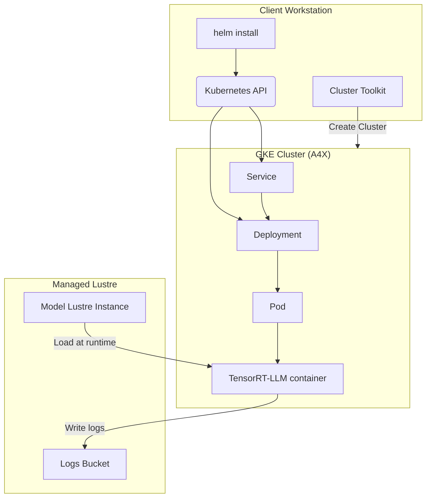

# Single Host Model Serving with NVIDIA TensorRT-LLM (TRT-LLM) and Google Cloud Managed Lustre on A4X GKE Node Pool

This document outlines the steps to serve and benchmark various Large Language Models (LLMs) using the [NVIDIA TensorRT-LLM](https://github.com/NVIDIA/TensorRT-LLM) framework on a single [A4X GKE Node pool](https://cloud.google.com/kubernetes-engine), with model stored in [Google Cloud Managed Lustre](https://docs.cloud.google.com/managed-lustre/docs/overview).

This guide walks you through setting up the necessary cloud infrastructure, configuring your environment, and deploying a high-performance LLM for inference.

<a name="table-of-contents"></a>
## Table of Contents

- [Single Host Model Serving with NVIDIA TensorRT-LLM (TRT-LLM) and Google Cloud Managed Lustre on A4X GKE Node Pool](#single-host-model-serving-with-nvidia-tensorrt-llm-trt-llm-and-google-cloud-managed-lustre-on-a4x-gke-node-pool)
  - [Table of Contents](#table-of-contents)
  - [1. Test Environment](#1-test-environment)
  - [2. High-Level Flow](#2-high-level-flow)
  - [3. Environment Setup (One-Time)](#3-environment-setup-one-time)
    - [3.1. Clone the Repository](#31-clone-the-repository)
    - [3.2. Configure Environment Variables](#32-configure-environment-variables)
    - [3.3. Connect to your GKE Cluster](#33-connect-to-your-gke-cluster)
    - [3.4 Upload the Model Checkpoints](#34-upload-the-model-checkpoints)
    - [3.5 Create Persistent Volumes and Persistent Volume Claims](#35-create-persistent-volumes-and-persistent-volume-claims)
    - [3.6 Enable Managed Lustre CSI Driver on an Existing GKE Cluster](#36-enable-managed-lustre-csi-driver-on-an-existing-gke-cluster)
  - [4. Run the recipe](#4-run-the-recipe)
    - [4.1. Inference benchmark for DeepSeek-R1 671B Model](#41-inference-benchmark-for-deepseek-r1-671b-model)
  - [5. Monitoring and Troubleshooting](#5-monitoring-and-troubleshooting)
    - [5.1. Check Deployment Status](#51-check-deployment-status)
    - [5.2. View Logs](#52-view-logs)
  - [6. Cleanup](#6-cleanup)

<a name="test-environment"></a>
## 1. Test Environment

[Back to Top](#table-of-contents)

The recipe uses the following setup:

* **Orchestration**: [Google Kubernetes Engine (GKE)](https://cloud.google.com/kubernetes-engine)
* **Deployment Configuration**: A [Helm chart](https://helm.sh/) is used to configure and deploy a [Kubernetes Deployment](https://kubernetes.io/docs/concepts/workloads/controllers/deployment/). This deployment encapsulates the inference of the target LLM using the TensorRT-LLM framework.  A separate Helm chart creates the necessary Persistent Volume (PV) and Persistent Volume Claim (PVC), facilitating access to the model stored in
  [Google Cloud Managed Lustre](https://docs.cloud.google.com/managed-lustre/docs/overview).

This recipe has been optimized for and tested with the following configuration:

* **GKE Cluster**:
    * A [regional standard cluster](https://cloud.google.com/kubernetes-engine/docs/concepts/configuration-overview) version: `1.33.4-gke.1036000` or later.
    * A GPU node pool with 1 [a4x-highgpu-4g](https://cloud.google.com/compute/docs/gpus) machine.
    * [Workload Identity Federation for GKE](https://cloud.google.com/kubernetes-engine/docs/concepts/workload-identity) enabled.
    * [Cloud Storage FUSE CSI driver for GKE](https://cloud.google.com/kubernetes-engine/docs/concepts/cloud-storage-fuse-csi-driver) enabled.
    * [DCGM metrics](https://cloud.google.com/kubernetes-engine/docs/how-to/dcgm-metrics) enabled.
    * [Kueue](https://kueue.sigs.k8s.io/docs/reference/kueue.v1beta1/) and [JobSet](https://jobset.sigs.k8s.io/docs/overview/) APIs installed.
    * Kueue configured to support [Topology Aware Scheduling](https://kueue.sigs.k8s.io/docs/concepts/topology_aware_scheduling/).
* A regional Google Cloud Storage (GCS) bucket to store logs generated by the recipe runs.
* A Google Cloud Managed Lustre instance to store model folder. The Lustre instance should be in the same PVC network as your GKE cluster.

> [!IMPORTANT]
> - To prepare the required environment, see the [GKE environment setup guide](../../../../docs/configuring-environment-gke-a4x.md).
> Provisioning a new GKE cluster is a long-running operation and can take **20-30 minutes**.
> - GCS buckets and Lustre instances must be in the same region as the GKE cluster.

<a name="architecture"></a>
## 2. High-Level Flow

[Back to Top](#table-of-contents)

Here is a simplified diagram of the flow that we follow in this recipe:



* **helm:** A package manager for Kubernetes to define, install, and upgrade applications. It's used here to configure and deploy the Kubernetes Deployment.
* **Deployment:** Manages the lifecycle of your model server pod, ensuring it stays running.
* **Service:** Provides a stable network endpoint (a DNS name and IP address) to access your model server.
* **Pod:** The smallest deployable unit in Kubernetes. The Triton server container with TensorRT-LLM runs inside this pod on a GPU-enabled node.
* **Cloud Storage:** Cloud Storage buckets to store benchmark logs and other artifacts.
* **Managed Lustre:** Managed Lustre instances to store model folder.

<a name="environment-setup"></a>
## 3. Environment Setup (One-Time)

[Back to Top](#table-of-contents)

First, you'll configure your local environment. These steps are required once before you can deploy any models.

<a name="clone-repo"></a>
### 3.1. Clone the Repository

```bash
git clone https://github.com/ai-hypercomputer/gpu-recipes.git
cd gpu-recipes
export REPO_ROOT=$(pwd)
export RECIPE_ROOT=$REPO_ROOT/inference/a4x/single-host-serving/tensorrt-llm-lustre
```

<a name="configure-vars"></a>
### 3.2. Configure Environment Variables

This is the most critical step. These variables are used in subsequent commands to target the correct resources.

```bash
export PROJECT_ID=<YOUR_PROJECT_ID>
export CLUSTER_REGION=<YOUR_CLUSTER_REGION>
export CLUSTER_NAME=<YOUR_CLUSTER_NAME>
export KUEUE_NAME=<YOUR_KUEUE_NAME>
export GCS_BUCKET_LOGS=<YOUR_GCS_BUCKET_LOGS>
export LUSTRE_INSTANCE_NAME_SERVING_MODEL=<YOUR_LUSTRE_INSTANCE_NAME_SERVING_MODEL>
export LUSTER_FOLDER_SERVING_MODEL=<YOUR_LUSTRE_FOLDER_SERVING_MODEL>
export LUSTRE_CAPACITY_SERVING_MODEL=<YOUR_LUSTRE_CAPACITY_SERVING_MODEL>
export LUSTRE_PROJECT_SERVING_MODEL=<YOUR_LUSTRE_PROJECT_ID_SERVING_MODEL>
export LUSTRE_LOCATION_SERVING_MODEL=<YOUR_LUSTRE_LOCATION_SERVING_MODEL>
export LUSTRE_IP_ADDRESS_SERVING_MODEL=<YOUR_LUSTRE_IP_ADDRESS_SERVING_MODEL>
export LUSTRE_FILE_SYSTEM_SERVING_MODEL=<YOUR_LUSTRE_FILE_SYSTEM_SERVING_MODEL>
export TRTLLM_VERSION=1.2.0rc2

export PROJECT_ID=supercomputer-testing
export CLUSTER_REGION=us-central1
export CLUSTER_NAME=a4x-baker
export GCS_BUCKET_LOGS=tess-benchmark-outputs
export LUSTRE_INSTANCE_NAME_SERVING_MODEL=a4x-baker
export LUSTER_FOLDER_SERVING_MODEL=DeepSeek-R1-NVFP4-v2
export LUSTRE_CAPACITY_SERVING_MODEL=126000Gi
export LUSTRE_PROJECT_SERVING_MODEL=supercomputer-testing
export LUSTRE_LOCATION_SERVING_MODEL=us-central1-b
export LUSTRE_IP_ADDRESS_SERVING_MODEL=172.21.47.3
export LUSTRE_FILE_SYSTEM_SERVING_MODEL=lustrefs
export TRTLLM_VERSION=1.2.0rc2

# Set the project for gcloud commands
gcloud config set project $PROJECT_ID
```

Replace the following values:

| Variable              | Description                                                                                             | Example                                                 |
| --------------------- | ------------------------------------------------------------------------------------------------------- | ------------------------------------------------------- |
| `PROJECT_ID` | Your Google Cloud Project ID. | `gcp-project-12345` |
| `CLUSTER_REGION` | The GCP region where your GKE cluster is located. | `us-central1` |
| `CLUSTER_NAME` | The name of your GKE cluster. | `a4x-cluster` |
| `KUEUE_NAME` | The name of the Kueue local queue. The default queue created by the cluster toolkit is `a4x`. Verify the name in your cluster. | `a4x` |
| `GCS_BUCKET_LOGS` | Name of your GCS logs bucket (do not include `gs://`). | `my-benchmark-logs-bucket` |
| `LUSTRE_INSTANCE_NAME_SERVING_MODEL` | The name of your Lustre instance. | `my-benchmark-model-lustre` |
| `LUSTER_FOLDER_SERVING_MODEL` | The path to the GCS model folder on the Lustre. | `my-benchmark-model-folder` |
| `LUSTRE_CAPACITY_SERVING_MODEL` | The capacity of your Lustre instance. | `my-benchmark-model-folder` |
| `LUSTRE_PROJECT_SERVING_MODEL` | The project where your Lustre instance resides. | `my-benchmark-model-folder` |
| `LUSTRE_LOCATION_SERVING_MODEL` | The zonal location of your Lustre instance. | `my-benchmark-model-folder` |
| `LUSTRE_IP_ADDRESS_SERVING_MODEL` | The IP address of your Lustre instance, it can be obtained from the mountPoint field.  | `my-benchmark-model-folder` |
| `LUSTRE_FILE_SYSTEM_SERVING_MODEL` | The file system name of your Managed Lustre instance. | `my-benchmark-model-folder` |
| `TRTLLM_VERSION` | The tag/version for the Docker image. Other verions can be found at https://catalog.ngc.nvidia.com/orgs/nvidia/teams/tensorrt-llm/containers/release | `1.2.0rc2` |

To locate your Managed Lustre instance and collect the Lustre instance information, you can run the following command:

```
gcloud lustre instances list \
    --project=${LUSTRE_PROJECT_SERVING_MODEL} \
    --location=${LUSTRE_LOCATION_SERVING_MODEL}
```

The output should look similar to the following. Before you proceed to the next step, make sure to note down the Managed Lustre instance name, filesystem, and the mountPoint fields.

```
capacityGib: '9000'
createTime: '2025-04-28T22:42:11.140825450Z'
filesystem: testlfs
gkeSupportEnabled: true
mountPoint: 10.90.1.4@tcp:/testlfs
name: projects/my-project/locations/us-central1-a/instances/my-lustre
network: projects/my-project/global/networks/default
perUnitStorageThroughput: '1000'
state: ACTIVE
updateTime: '2025-04-28T22:51:41.559098631Z'
```

<a name="connect-cluster"></a>
### 3.3. Connect to your GKE Cluster

Fetch credentials for `kubectl` to communicate with your cluster.

```bash
gcloud container clusters get-credentials $CLUSTER_NAME --region $CLUSTER_REGION
```

<a name="download-model-checkpoints"></a>
### 3.4 Upload the Model Checkpoints

To download the model from HuggingFace, please follow the steps below:

1.  Follow these [instructions](https://docs.cloud.google.com/managed-lustre/docs/connect-from-compute-engine) to create a compute
    engine and mount your Lustre instance onto it.
3.  Access into the mount point on compute engine and create the model folder.
4.  Under the mount point,
    [download](https://huggingface.co/docs/hub/en/models-downloading) the model
    using the `hf` command:

    ```bash
    hf download {MODEL_NAME} --local-dir .
    ```

<a name="create-pv-pvc"></a>
### 3.5 Create Persistent Volumes and Persistent Volume Claims

The inference deployment accesses Lustre instances for serving model using
Kubernetes Persistent Volumes (PV) and Persistent Volume
Claims (PVC). You must generate PVs and PVCs for serving model lustre
instances using the
[lustre helper Helm chart](../../../../src/helm-charts/storage/lustre).

```bash
helm install -f $REPO_ROOT/src/helm-charts/storage/lustre/values.yaml \
--set lustreVolumes[0].instance_name=${LUSTRE_INSTANCE_NAME_SERVING_MODEL} \
--set lustreVolumes[0].project_id=${LUSTRE_PROJECT_SERVING_MODEL} \
--set lustreVolumes[0].location=${LUSTRE_LOCATION_SERVING_MODEL} \
--set lustreVolumes[0].ip_address=${LUSTRE_IP_ADDRESS_SERVING_MODEL} \
--set lustreVolumes[0].capacity=${LUSTRE_CAPACITY_SERVING_MODEL} \
--set lustreVolumes[0].file_system=${LUSTRE_FILE_SYSTEM_SERVING_MODEL} \
$USER-lustre-pv-pvc \
$REPO_ROOT/src/helm-charts/storage/lustre
```

<a name="enable-lustre-csi-driver"></a>
### 3.6 Enable Managed Lustre CSI Driver on an Existing GKE Cluster

If the Managed Lustre CSI driver is not enabled on your GKE cluster, please
follow these [instructions](https://docs.cloud.google.com/kubernetes-engine/docs/how-to/persistent-volumes/lustre-csi-driver-existing-instance#existing-cluster)
to enable it.

<a name="run-the-recipe"></a>
## 4. Run the recipe

[Back to Top](#table-of-contents)

This recipe supports the deployment of the following models:

1.  [DeepSeek-R1-NVFP4-v2](#serving-deepseek-r1)

> [!NOTE]
> After running the recipe with `helm install`, it can take **up to 30 minutes** for the deployment to become fully available. This is because the GKE node must first pull the Docker image.

<a name="serving-deepseek-r1"></a>
### 4.1. Inference benchmark for DeepSeek-R1 671B Model

[Back to Top](#table-of-contents)

The recipe runs inference throughputs benchmark for [DeepSeek-R1 671B NVFP4 model](https://huggingface.co/nvidia/DeepSeek-R1-NVFP4-v2) which is Nvidia's pre-quantized FP4 checkpoint of the original [DeepSeek-R1 671B model](https://huggingface.co/deepseek-ai/DeepSeek-R1).

The recipe uses [`trtllm-bench`](https://github.com/NVIDIA/TensorRT-LLM/blob/main/docs/source/performance/perf-benchmarking.md), a command-line tool from NVIDIA to benchmark the performance of TensorRT-LLM engine. For more information about `trtllm-bench`, see the [TensorRT-LLM documentation](https://github.com/NVIDIA/TensorRT-LLM).

> [!NOTE]
> The config file directly exposes the settings within TensorRT-LLM's llm_args.py class, which are passed to `trtllm-bench`, you can modify these as needed in [`src/frameworks/a4x/trtllm-configs/deepseek-r1-nvfp4.yaml`](../../../../src/frameworks/a4x/trtllm-configs/deepseek-r1-nvfp4.yaml)

1. Install the helm chart to prepare and benchmark the model using [`trtllm-bench`](https://github.com/NVIDIA/TensorRT-LLM/blob/main/docs/source/performance/perf-benchmarking.md) tool:

    ```bash
    cd $RECIPE_ROOT
    helm install -f values.yaml \
    --set-file workload_launcher=$REPO_ROOT/src/launchers/trtllm-launcher-lustre.sh \
    --set-file serving_config=$REPO_ROOT/src/frameworks/a4x/trtllm-configs/deepseek-r1-nvfp4.yaml \
    --set queue=${KUEUE_NAME} \
    --set "volumes.gcsMounts[0].bucketName=${GCS_BUCKET_LOGS}" \
    --set "volumes.pvcMounts[0].subPath=${LUSTER_FOLDER_SERVING_MODEL}" \
    --set workload.model.name=nvidia/DeepSeek-R1-NVFP4-v2 \
    --set workload.image=nvcr.io/nvidia/tensorrt-llm/release:${TRTLLM_VERSION} \
    $USER-serving-deepseek-r1-model \
    $REPO_ROOT/src/helm-charts/a4x/inference-templates-lustre/deployment
    ```

    This creates a Helm release and a Deployment named `$USER-serving-deepseek-r1-model`, and a Service named `$USER-serving-deepseek-r1-model-svc`.

2.  **Check the deployment status.**

    ```bash
    kubectl get deployment/$USER-serving-deepseek-r1-model
    ```

    Wait until the `READY` column shows `1/1`. See the [Monitoring and Troubleshooting](#monitoring) section to view the deployment logs.

  > [!NOTE]
  > - This helm chart is configured to run only a single benchmarking experiment for 1k requests for 128 tokens of input/output lengths. To run other experiments, you can add the various combinations provided in the [values.yaml](values.yaml) file.


<a name="monitoring"></a>
## 5. Monitoring and Troubleshooting

[Back to Top](#table-of-contents)

After the model is deployed via Helm as described in the sections [above](#run-the-recipe), use the following steps to monitor the deployment and interact with the model. Replace `<deployment-name>` and `<service-name>` with the appropriate names from the model-specific deployment instructions (e.g., `$USER-serving-deepseek-r1-model` and `$USER-serving-deepseek-r1-model-svc`).


<a name="check-status"></a>
### 5.1. Check Deployment Status

Check the status of your deployment. Replace the name if you deployed a different model.

```bash
# Example for DeepSeek-R1 671B
kubectl get deployment/$USER-serving-deepseek-r1-model
```

Wait until the `READY` column shows `1/1`. If it shows `0/1`, the pod is still starting up.

> [!NOTE]
> In the GKE UI on Cloud Console, you might see a status of "Does not have minimum availability" during startup. This is normal and will resolve once the pod is ready.

<a name="view-logs"></a>
### 5.2. View Logs

To see the logs from the TRTLLM server (useful for debugging), use the `-f` flag to follow the log stream:

```bash
kubectl logs -f deployment/$USER-serving-deepseek-r1-model
```

You should see logs indicating preparing the model, and then running the throughput benchmark test, similar to this:

```bash
Running benchmark for nvidia/DeepSeek-R1-NVFP4-v2 with ISL=128, OSL=128, TP=4, EP=4, PP=1

===========================================================
= PYTORCH BACKEND
===========================================================
Model:			nvidia/DeepSeek-R1-NVFP4-v2
Model Path:		/ssd/nvidia/DeepSeek-R1-NVFP4-v2
TensorRT LLM Version:	1.2
Dtype:			bfloat16
KV Cache Dtype:		FP8
Quantization:		NVFP4

===========================================================
= REQUEST DETAILS
===========================================================
Number of requests:             1000
Number of concurrent requests:  985.9849
Average Input Length (tokens):  128.0000
Average Output Length (tokens): 128.0000
===========================================================
= WORLD + RUNTIME INFORMATION
===========================================================
TP Size:                4
PP Size:                1
EP Size:                4
Max Runtime Batch Size: 2304
Max Runtime Tokens:     4608
Scheduling Policy:      GUARANTEED_NO_EVICT
KV Memory Percentage:   85.00%
Issue Rate (req/sec):   8.3913E+13

===========================================================
= PERFORMANCE OVERVIEW
===========================================================
Request Throughput (req/sec):                     X.XX
Total Output Throughput (tokens/sec):             X.XX
Total Token Throughput (tokens/sec):              X.XX
Total Latency (ms):                               X.XX
Average request latency (ms):                     X.XX
Per User Output Throughput [w/ ctx] (tps/user):   X.XX
Per GPU Output Throughput (tps/gpu):              X.XX

-- Request Latency Breakdown (ms) -----------------------

[Latency] P50    : X.XX
[Latency] P90    : X.XX
[Latency] P95    : X.XX
[Latency] P99    : X.XX
[Latency] MINIMUM: X.XX
[Latency] MAXIMUM: X.XX
[Latency] AVERAGE: X.XX

===========================================================
= DATASET DETAILS
===========================================================
Dataset Path:         /ssd/token-norm-dist_DeepSeek-R1-NVFP4-v2_128_128_tp4.json
Number of Sequences:  1000

-- Percentiles statistics ---------------------------------

        Input              Output           Seq. Length
-----------------------------------------------------------
MIN:   128.0000           128.0000           256.0000
MAX:   128.0000           128.0000           256.0000
AVG:   128.0000           128.0000           256.0000
P50:   128.0000           128.0000           256.0000
P90:   128.0000           128.0000           256.0000
P95:   128.0000           128.0000           256.0000
P99:   128.0000           128.0000           256.0000
===========================================================
```

<a name="cleanup"></a>
## 6. Cleanup

[Back to Top](#table-of-contents)

To avoid incurring further charges, clean up the resources you created.

1.  **Uninstall the Helm Release:**

    First, list your releases to get the deployed models:

    ```bash
    # list deployed models
    helm list --filter $USER-serving-
    ```

    Then, uninstall the desired release:

    ```bash
    # uninstall the deployed model
    helm uninstall <release_name>
    ```
    Replace `<release_name>` with the helm release names listed.

2.  **Delete the Persistent Volume and Persistent Volume Claim:**

    ```bash
    # uninstall the deployed pv and pvc.
    helm uninstall $USER-lustre-pv-pvc
    ```

3.  (Optional) Delete the built Docker image from Artifact Registry if no longer needed.
4.  (Optional) Delete Cloud Build logs.
5.  (Optional) Clean up files in your GCS bucket if benchmarking was performed.
6.  (Optional) Delete the [test environment](#test-environment) provisioned including GKE cluster.
