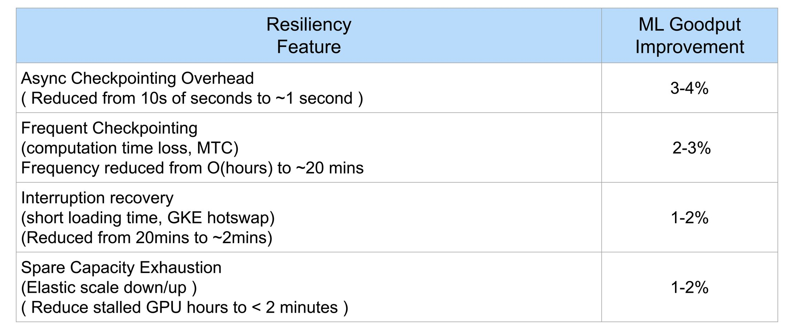

# Maximizing ML Training Efficiency: A General Guide to Improving GoodPut

Effective utilization of resources in large-scale machine learning (ML) training is crucial for both cost efficiency and rapid model development. A key metric for measuring this efficiency is **ML GoodPut**. As discussed in the Google Cloud blog post, "[Train AI for less: Improve ML Goodput with elastic training and optimized checkpointing](https://cloud.google.com/blog/products/ai-machine-learning/elastic-training-and-optimized-checkpointing-improve-ml-goodput)," GoodPut represents the actual productive training time, excluding time lost to various inefficiencies. Even a small percentage improvement in GoodPut can lead to significant cost savings and faster time-to-market for your models.

Achieving high GoodPut can be challenging due to several factors common in large distributed training environments:
*   **Frequent Interruptions:** Hardware failures, preemptions, or other system issues can halt training, requiring restarts from the latest checkpoint and wasting valuable compute time.
*   **Slow or Inefficient Checkpointing:** The process of saving model checkpoints can itself interrupt training or consume excessive resources if not optimized.
*   **Limited Observability and Slow Recovery:** Difficulty in quickly detecting, diagnosing, and remediating failures or stragglers can extend downtime and further reduce GoodPut.

This guide provides a general overview of techniques and tools to address these common challenges and maximize ML GoodPut. While the principles discussed are broadly applicable, we will use the [LLaMA3-1-70B pretraining recipe](https://github.com/AI-Hypercomputer/gpu-recipes/tree/main/training/a3mega/llama3-1-70b/nemo-pretraining-gke-resiliency) as a concrete case study to illustrate how these components can be implemented and customized for large-scale training workloads on Google Cloud. The goal is to showcase a "DIY" style product, where users can understand and selectively adopt these "Lego blocks" to build resilient and efficient training pipelines.

## Understanding Sources of BadPut (Lost Efficiency)

To effectively improve GoodPut, it's essential to understand the common culprits that lead to "BadPut" – the wasted time and resources during training. The previously mentioned [Google Cloud blog post](https://cloud.google.com/blog/products/ai-machine-learning/elastic-training-and-optimized-checkpointing-improve-ml-goodput) highlights several of these. In a case study referenced in the article, involving 1,024 A3 Mega GPU instances, overall ML GoodPut was improved from around 80% to over 90% by addressing these factors.

Key sources of BadPut include:

1.  **Hardware Failures and System Errors:**
    *   **Impact:** These can cause sudden job crashes, leading to lost training progress since the last checkpoint. The time taken to detect the failure, reprovision resources (if necessary), and restart the job contributes significantly to BadPut.
    *   **Example:** A GPU failing, a node becoming unresponsive, or critical system software errors.

2.  **Preemptions and Evictions:**
    *   **Impact:** In cloud environments or shared clusters, workloads might be preempted or evicted. Similar to hardware failures, this results in lost work and restart overhead.
    *   **Example:** Spot VMs/preemptible VMs being reclaimed, or higher-priority jobs displacing lower-priority ones.

3.  **Slow Checkpoint Save and Load Times:**
    *   **Impact:** If saving checkpoints (inline/synchronous) takes a long time, the GPUs are idle, directly reducing GoodPut. Similarly, slow loading of checkpoints after a restart extends downtime.
    *   **Example:** Saving large model states to slow storage, or inefficient serialization/deserialization of checkpoints.

4.  **Suboptimal Checkpoint Frequency:**
    *   **Impact:**
        *   *Too infrequent:* Leads to significant loss of work if a failure occurs late in a checkpoint interval.
        *   *Too frequent:* The cumulative time spent on checkpointing itself (even if asynchronous) can become a major overhead.
    *   **Example:** Setting a 4-hour checkpoint interval when failures occur every 2 hours, or checkpointing every 5 minutes with a process that takes 1 minute.

5.  **Stragglers and Performance Bottlenecks:**
    *   **Impact:** Slower nodes or processes (stragglers) can delay the entire training job, especially in synchronous training paradigms. This leads to underutilization of faster resources.
    *   **Example:** A single node with a faulty network connection slowing down data loading or gradient synchronization for all other nodes.

6.  **Lack of Rapid Failure Detection and Diagnosis:**
    *   **Impact:** The longer it takes to identify that a problem has occurred and what the root cause is, the longer the downtime and the greater the BadPut.
    *   **Example:** A silent error corrupting data without immediate detection, or lack of clear logs making diagnosis time-consuming.

The blog post further provides a table (via an image link: ) that details the specific metric improvements and ML GoodPut contributions for different techniques applied in their case study. While the visual data from the image cannot be rendered here, it underscores that a multi-faceted approach targeting these BadPut sources is key to substantial GoodPut gains.

## Addressing Interruptions: Elastic Training

Elastic training is a core strategy for improving ML GoodPut by making training workloads resilient to interruptions. Instead of a job failing entirely when an issue occurs, elastic training allows the job to adapt to the changing environment. This could involve recovering from a transient error, transparently moving to different hardware, or adjusting the job size to continue training on available resources.

The LLaMA3-1-70B recipe, as a case study, implements these elastic training principles through the **Google Cloud Resiliency library**. This library is designed to work with GKE and leverages the [NVIDIA Resiliency Extension](https://github.com/NVIDIA/nvidia-resiliency-ext) for certain low-level hardware interactions and failure signaling.

Key components and concepts include:

### 1. Failure Sensing and Mitigation: The Supervisor System

A sophisticated supervisor system is deployed to monitor the health of the training cluster and the job itself. This system is crucial for quickly identifying issues and orchestrating a response. It consists of:

*   **Supervisor Components:** These typically run on a dedicated CPU node pool.
    *   **Sensor:** Actively monitors the training job and cluster components for failure signals, performance degradation, or straggler behavior. It might use heartbeat mechanisms (polling worker nodes) and receive signals from other sources like the Host Monitors. The [`heartbeat_polling_period_s`](values-supervisor.yaml) and [`heartbeat_timeout_s`](values-supervisor.yaml) in `values-supervisor.yaml` are critical for this.
    *   **Controller:** The central "brain" that receives event data from the Sensor. It consults a user-defined policy (or its internal logic) to decide on the appropriate remediation action.
    *   **Actuator:** Executes the remediation actions chosen by the Controller, such as initiating a job restart, requesting a node replacement, or triggering a scaling operation.
    *   The configuration for these components, including their Docker images and startup commands, can be found in [values-supervisor.yaml](values-supervisor.yaml).
    *   The Kubernetes service accounts and roles required for the Supervisor to interact with GKE resources are defined in [ksa-setup.yaml](ksa-setup.yaml).
    *   The underlying Helm chart that deploys these supervisor components is located in [src/helm-charts/resiliency/supervisor-chart/](../../../../src/helm-charts/resiliency/supervisor-chart/).

This entire Supervisor system (Sensor, Controller, Actuator, and Host Monitors) is designed as a modular 'Lego block'. While showcased here with NeMo, its components and principles can be adapted for other training frameworks by customizing the interaction points, primarily through the Actuator's remediation scripts and the policies defined in `values-supervisor.yaml`.

#### Using the Supervisor with Your Custom Model
This Supervisor system can be integrated with your custom training frameworks or models beyond the LLaMA3-1-70B NeMo example. Here's a general guide:

*   **Deployment:** The Supervisor system (Supervisor controllers and Host Monitor DaemonSet) is deployed via its dedicated Helm chart, found at [src/helm-charts/resiliency/supervisor-chart/](../../../../src/helm-charts/resiliency/supervisor-chart/).
*   **Configuration:** Crucially, you'll need to customize the [values-supervisor.yaml](values-supervisor.yaml) file. This includes:
    *   Defining your GKE cluster setup (node pools, etc.).
    *   Setting appropriate monitoring parameters like heartbeat intervals, timeouts, and failure detection thresholds ([`heartbeat_polling_period_s`](values-supervisor.yaml), [`heartbeat_timeout_s`](values-supervisor.yaml), [`pod_termination_threshold_s`](values-supervisor.yaml), [`jobset_downtime_threshold_s`](values-supervisor.yaml)) to match your job's behavior.
    *   Specifying the remediation policies and scripts the Actuator should use for events like job restarts, node replacements, or scaling.
*   **Actuator Integration:** The core of the integration lies in how the Supervisor's Actuator component interacts with your custom training application. Your application must be controllable via external commands or signals that the Actuator can trigger. This might involve:
    *   The Actuator executing custom scripts that interact with your job (e.g., to stop, start, or send signals).
    *   Your training framework exposing APIs that the Actuator can call.
    *   Using signals (e.g., SIGUSR1, SIGTERM) that your application traps to initiate actions like saving a checkpoint and exiting, or re-evaluating cluster membership.
*   **Checkpointing and Resumption:** Your custom application must implement robust checkpointing and the ability to resume training from these checkpoints. This is essential because Supervisor-initiated actions (like restarting a job after a failure or preemption) will rely on your application's capability to continue from the last known good state.

By carefully configuring these aspects, you can leverage the Google Cloud Resiliency library's Supervisor system to bring enhanced fault tolerance and elastic training capabilities to a wide range of ML workloads.

*   **Host Monitors:** These are deployed as a Kubernetes DaemonSet, ensuring one runs on each GPU worker node (e.g., A3 Mega nodes).
    *   They provide granular, node-level health information and can detect local hardware issues (like GPU errors) more directly.
    *   They communicate with the central Supervisor, feeding it critical data for decision-making. Configuration details are also present in `values-supervisor.yaml` (see [`host_daemon` section](values-supervisor.yaml)).

The interaction between these components allows the system to automatically sense disruptions (e.g., using parameters like [`pod_termination_threshold_s`](values-supervisor.yaml) and [`jobset_downtime_threshold_s`](values-supervisor.yaml) from `values-supervisor.yaml`) and initiate mitigation procedures. The system also supports fault injection ([`enable_fault_injection`](values-supervisor.yaml) in `values-supervisor.yaml`) for testing resiliency.

### 2. Remediation Strategies

The Google Cloud Resiliency library, leveraging the NVIDIA Resiliency Extension, is designed to support various remediation strategies. The exact policy and automation level can be customized:

*   **In-Job Restarts / GPU Reset:** For certain correctable errors (e.g., transient GPU issues), the NVIDIA library might enable an in-job restart or a GPU reset to restore functionality without full node replacement.
*   **Node Hot Swap:** In case of unrecoverable hardware failures, the Supervisor can coordinate with GKE to replace the faulty node with a healthy one from a spare pool, then rejoin it to the training job.
*   **Scaling Down (and Up):** If spare resources aren't immediately available, the job can be automatically scaled down (e.g., reducing the number of data-parallel replicas, configured via [`num_dp_replicas`](values-supervisor.yaml) and [`num_nodes_per_dp`](values-supervisor.yaml) in `values-supervisor.yaml`) to continue training on the remaining healthy nodes. When replacement nodes become available, the system is designed to allow the training job to scale back up, maximizing resource utilization. User-defined callbacks (typically part of the training framework integration) can help adjust hyperparameters like learning rate and batch size during such elasticity events.

### State of Support

The Elastic Training features provided by the Google Cloud Resiliency library, as demonstrated in the LLaMA3-1-70B recipe (Supervisor, Host Monitors, integration with GKE and NVIDIA Resiliency Extension), are considered **Production-ready** components. They provide a robust framework for improving the resilience of large-scale training jobs on Google Cloud. The specific remediation policies and their triggers can be further customized.
## Minimizing Downtime: Optimized Checkpointing

Checkpointing is vital for fault tolerance, allowing training to resume from a saved state. However, the checkpointing process itself can consume valuable time and, if not optimized, reduce GoodPut. The LLaMA3-1-70B recipe, as an example, incorporates several strategies for optimized checkpointing, aligning with principles from the [Google Cloud blog post](https://cloud.google.com/blog/products/ai-machine-learning/elastic-training-and-optimized-checkpointing-improve-ml-goodput).

These strategies focus on making checkpointing faster, less intrusive, and more resilient. These strategies—asynchronous operations, distributed saves/loads, and leveraging robust cloud storage via FUSE—are themselves modular 'Lego blocks' that can be adopted independently or combined to enhance the I/O performance and resilience of various training setups, not limited to NeMo or this specific recipe.

### 1. Asynchronous Checkpointing

To prevent training pauses during checkpoint saves, this recipe leverages asynchronous checkpointing. This means the training process (e.g., GPU computation) can continue while checkpoints are being written to storage in the background. This is typically achieved by first copying the checkpoint data from GPU memory to host CPU memory, which is a fast operation, and then the host CPU handles the slower write to persistent storage.

*   This capability is enabled in the NeMo framework (used in the LLaMA3-1-70B recipe) via flags in the main `workload.flags` section of `training/a3mega/llama3-1-70b/nemo-pretraining-gke-resiliency/values.yaml`:
    *   `--enable-async-ckpt`: Enables the basic asynchronous checkpointing feature.
    *   `--enable-optimized-async-ckpt`: Enables further optimizations for the asynchronous checkpointing mechanism, potentially improving the efficiency of offloading data from GPU HBM to host memory and managing the subsequent save.
    *   `--ckpt-threads-per-rank=2`: (Example from `values.yaml`) Configures the number of threads per rank dedicated to checkpointing operations, which can help parallelize and speed up the process.

### 2. Distributed Checkpointing

For large models trained across many GPUs, saving and loading checkpoints can be a bottleneck if handled by a single process or node. Distributed checkpointing, often a feature of the training framework (like PyTorch, which NeMo builds upon), addresses this by parallelizing the save/load operations across multiple workers/nodes. Each rank or a subset of ranks saves its portion of the model state concurrently.

*   The `--enable-dist-ckpt` flag in `training/a3mega/llama3-1-70b/nemo-pretraining-gke-resiliency/values.yaml` activates this feature.
*   For more details on PyTorch's distributed checkpointing capabilities, refer to the [PyTorch Distributed Documentation](https://pytorch.org/docs/stable/distributed.html) (specific links may vary by PyTorch version, search for "distributed checkpointing" or "state_dict").

### 3. Multi-Tier Checkpointing Strategy (Leveraging GCS with FUSE)

The blog post describes an ideal multi-tiered approach (local node storage, peer node storage, cloud storage) for balancing speed and resilience. The LLaMA3-1-70B recipe prominently features Google Cloud Storage (GCS) as a robust and scalable tier for durable checkpoint storage, accessed via the [Cloud Storage FUSE CSI driver](https://cloud.google.com/kubernetes-engine/docs/how-to/persistent-volumes/cloud-storage-fuse-csi-driver).

*   **GCS for Checkpoints:**
    *   The `training/a3mega/llama3-1-70b/nemo-pretraining-gke-resiliency/values-gcs.yaml` file defines the GCS bucket to be used (e.g., `gcs-checkpoints`).
    *   The main `README.md` of the recipe details setting up the GCS bucket (Hierarchical Namespace recommended) and configuring access via a Kubernetes Persistent Volume (PV) and Persistent Volume Claim (PVC).
    *   The `infrastructure.enable_gcsfuse: true` setting in `training/a3mega/llama3-1-70b/nemo-pretraining-gke-resiliency/values.yaml` ensures that GCS FUSE is utilized for the job.
    *   The underlying Helm chart for GCS FUSE setup can be found in `src/helm-charts/storage/gcs-fuse/`.
*   **How GCS FUSE Helps:** GCS FUSE allows Kubernetes Pods to mount a GCS bucket as a local filesystem. This simplifies access for training frameworks, as they can read/write checkpoints to what appears to be a local path, while the data is actually persisted to GCS. This is crucial for both saving checkpoints and for restoring them during job recovery.
*   While this recipe focuses on GCS as the primary persistent checkpointing backend, advanced configurations within NeMo/PyTorch might allow for staging checkpoints on local SSDs before asynchronous upload to GCS, achieving a multi-tier behavior.

### 4. Configurable Checkpoint Frequency

The optimal frequency for saving checkpoints is a balance: too infrequent, and you risk losing significant work; too frequent, and the overhead (even if async) can become substantial.

*   The `--checkpoint-interval=25` (by default, measured in training steps) in the `workload.flags` section of `training/a3mega/llama3-1-70b/nemo-pretraining-gke-resiliency/values.yaml` allows users to tune this.
*   Other related flags like `--topk-ckpt=-1` (from `values.yaml`, meaning keep all checkpoints in this case) also play a role in the checkpointing strategy.

### State of Support

The Optimized Checkpointing features showcased in this recipe, including asynchronous and distributed checkpointing via NeMo/PyTorch flags and the use of GCS with GCS FUSE for durable checkpoint storage, are considered **Production-ready**. These are well-established techniques for improving I/O performance and resilience in large-scale training. Tuning these parameters appropriately for your specific model size, training duration, and failure rates is key to maximizing their benefit.
## Measuring Success: Goodput Analysis

Improving GoodPut is an ongoing process, and being able to measure it is critical to understanding the impact of the strategies you implement. The `gpu-recipes` repository provides a utility to help with this analysis.

*   **Resiliency Metrics Tool:**
    *   Located in the `src/utils/resiliency_metrics/` directory (relative to the root of the `gpu-recipes` repository), the `calculator.py` script is designed to analyze training job logs and calculate various metrics, including the overall GoodPut percentage.
    *   The main `training/a3mega/llama3-1-70b/nemo-pretraining-gke-resiliency/README.md` for the LLaMA3-1-70B recipe includes instructions on how to set up and run this tool. It typically involves parsing logs to identify events like job starts, checkpoint loads/saves, and total runtime to derive the effective computation time versus total time.

Using this tool, or similar log analysis techniques, allows you to quantify the benefits of elastic training and optimized checkpointing, identify remaining bottlenecks, and further tune your setup for maximum efficiency.
## Conclusion: Towards More Efficient and Resilient Training

Maximizing ML GoodPut is essential for controlling costs and accelerating innovation in large-scale AI model development. By implementing robust elastic training mechanisms and optimized checkpointing strategies, as demonstrated in this LLaMA3-1-70B recipe, you can significantly reduce wasted compute time and improve the overall efficiency and resilience of your training pipelines.

The Google Cloud Resiliency library, combined with features within frameworks like NVIDIA NeMo and PyTorch, and leveraging Google Cloud infrastructure like GKE and GCS, provides a powerful toolkit. We encourage you to explore these "Lego blocks," adapt them to your specific needs, and continuously measure and refine your setup to achieve the best possible GoodPut for your demanding training workloads.
